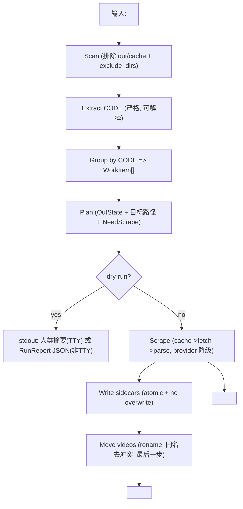

# 架构设计（数据结构优先）

目标：用稳定的「数据模型 + 流水线算法 + 文件系统契约」做地基，把易变部分（站点 HTML、网络策略、输出格式）隔离为可插拔组件。

## 1. 分层与依赖方向

依赖方向只能从上到下（禁止反向依赖）：

1) `cmd/`（入口）
- 只做 CLI 解析、配置发现与覆盖合并、打印输出/退出码。

2) `internal/app/`（用例编排，算法中心）
- 端到端流程：scan -> extract code -> group -> plan -> execute -> report。
- 只依赖 domain + 抽象接口（provider/cache/fs/http），不依赖具体实现。

3) `internal/domain/`（纯数据与不变量）
- 核心数据结构：`Code/VideoFile/WorkItem/ItemPlan/MovieMeta/RunReport`。
- 规范化与校验：CODE 解析、路径语义、错误码枚举。
- **禁止 IO**（不读文件、不打网络）。

4) `internal/infra/`（IO 能力实现）
- `fsx`：Walk/Stat/Mkdir/Rename/atomic write 等。
- `httpx`：HTTP client 工厂（proxy/UA/keepalive policy）+ bounded retry。
- `cache`：文件缓存（HTML/JSON）实现（固定 `<path>/cache/`）。

5) `internal/provider/`（站点插件）
- `javbus`/`javdb`：页面定位 + HTML 解析 -> `MovieMeta`。
- 用 fixture/golden 测试锁结构变化。

> 关键点：**app 层只处理 WorkItem，不处理“文件名怎么拼”“HTTP 怎么重试”这类细节**，这些细节在 infra/provider 中可替换。

---

## 2. 数据流（文件系统即 API）

---

## 3. 扩展点（新增需求不动地基）

### 3.1 新增 provider
新增一个站点只需要：
- 新包 `internal/provider/<name>/`
- 实现 `Provider` 接口（见 [PROVIDERS.md](./PROVIDERS.md)）
- 增加 `testdata/*.html` 与 golden JSON，锁住解析字段
- 注册到 registry

app 层不应因为新增 provider 而变复杂。

### 3.2 新增 sidecar 输出格式
把 NFO 写入抽象成 `Emitter`（例如 `NFOEmitter`）。
未来新增 `.json/.yaml` 只需要新增 emitter 并在 planner 中声明需要的 sidecar，不改变扫描/刮削/移动逻辑。

### 3.3 更换缓存后端
缓存目前以文件为准（简单可解释）。
若未来需要 SQLite，只替换 `cache` 实现与路径布局，不改变 app 层算法。

---

## 4. 性能与复杂度（不做“聪明”）

### 4.1 复杂度
- 扫描：`O(N)`（N 为文件/目录数量）
- 分组：`O(M)`（M 为视频文件数量），`map[Code]int` 索引避免重复拷贝
- 计划：`O(M)`（每个 WorkItem 只做 stat，不读文件内容）
- 网络：按 `WorkItem` 并发（concurrency 个 worker），**不在单条 item 内引入复杂并行**

### 4.2 数据局部性
- `[]VideoFile` 扁平存储；`WorkItem` 只存 file index，避免复制大结构。
- `OutState.ExistingNames` 用 map 做 O(1) 冲突判定；规模只在单个 out 目录内，足够小。

### 4.3 可恢复性优先
任何“优化”都不得破坏：
- move 最后一步
- 原子写入 + 不覆盖
- 幂等可重跑
